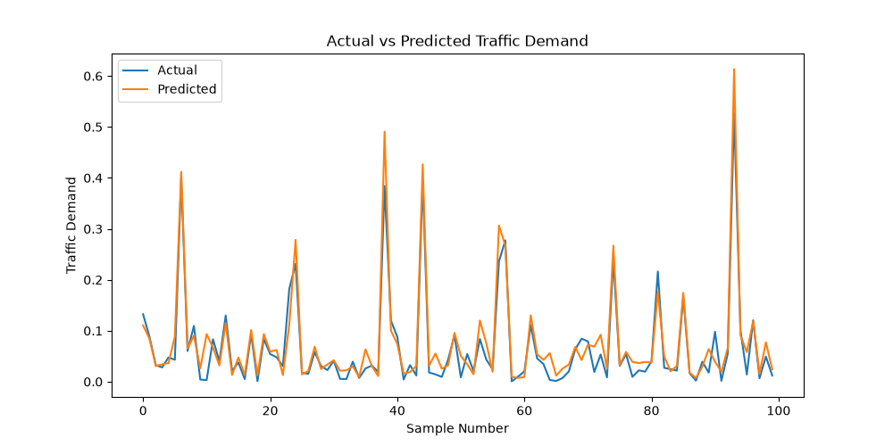
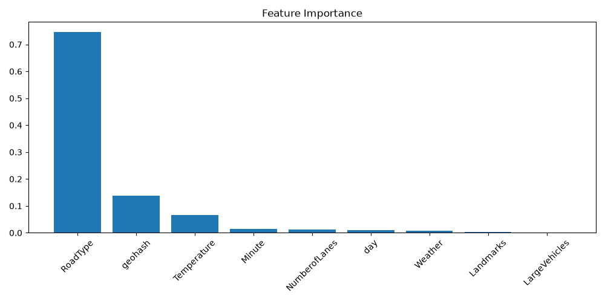
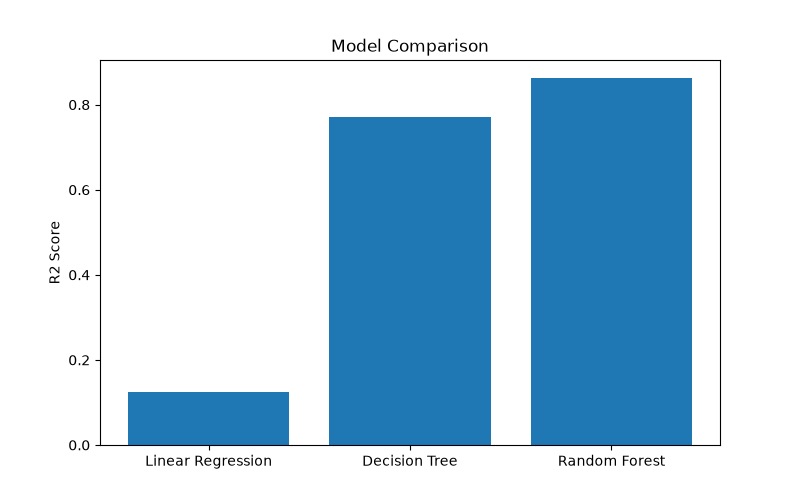

# Machine Learning-Based Urban Traffic Demand Forecasting and Signal Timing Recommendation System

## Overview

This project predicts urban traffic demand using machine learning techniques and Bengaluru traffic data. The system forecasts traffic demand, analyzes traffic patterns, and provides adaptive signal timing recommendations for smart traffic management applications.

## Features

- Traffic demand prediction using Random Forest Regression
- Model comparison using Linear Regression, Decision Tree, and Random Forest
- Feature importance analysis
- Ablation study
- Peak traffic analytics
- Signal timing recommendation system

## Model Performance

|       Model       | R² Score |
|-------------------|----------|
| Linear Regression |   0.124  |
| Decision Tree     |   0.905  |
| Random Forest     |   0.943  |

## Key Insights

- Geographical location (Geohash) was the most influential feature.
- Road type significantly impacted traffic demand prediction.
- Peak traffic hour identified: 11:00–12:00.
- Most congested road type: Highway.
- Rainy conditions were associated with higher traffic demand.

## Visualizations

### Actual vs Predicted Traffic Demand

### Feature Importance Analysis

### Model Comparison

## Tech Stack

- Python
- Pandas
- NumPy
- Scikit-Learn
- Matplotlib
- Joblib

## Future Scope

- Dynamic traffic signal control
- Emergency vehicle prioritization
- Real-time traffic demand forecasting
- Integration with smart city traffic management systems
- AI-assisted adaptive signal timing

